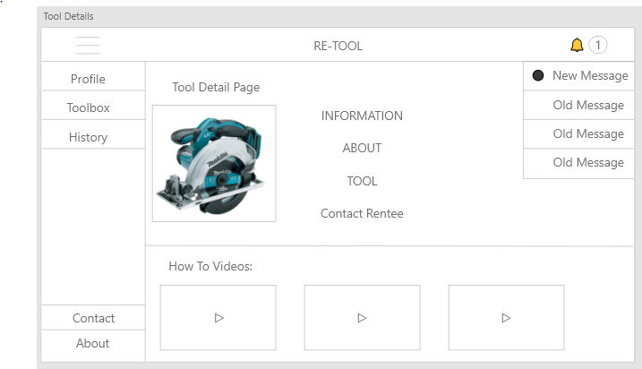

# RE-TOOL

**Re-Tool** is a platform for renting and renting-out tools.  A user with a profile can search for tools within their area that are available to rent at a fixed price per hour.  Alternatively, a user can curate a list of their tools that they are willing to rent to other users.  The website will feature messaging, how-to videos for a searched tool, and a user history.

## Tech Stack
### Front End
* HTML
* CSS
* JavaScript
* Bootstrap
* React

### Back End
* NodeJS
* Express or Hapi.js?
* Mongo/MySQL?
* Heroku
* GraphQL?
* APIs
  * YouTube

## Roles of Members
1. **Nathan**: React, API Routing
2. **Andrea**:React, Database
3. **Mihir**:React, GraphQL
4. **Raynor**:React, CSS
5. **Team**:React, Heroku

## MVP
* User Profile/Authentication 
  * Google/Facebook/Email ← pick easiest one 
* Search 
  * List view 
* CRUD API for tools 
* Messaging 
* Youtube “how-to” videos 
 
## Nice To Haves
* Notifications 
* Google Maps API
* Search history 
* Payments (link PayPal) 
* Chat popup (contact customer support) 
* Admin page (user data access) 
* Calendar

